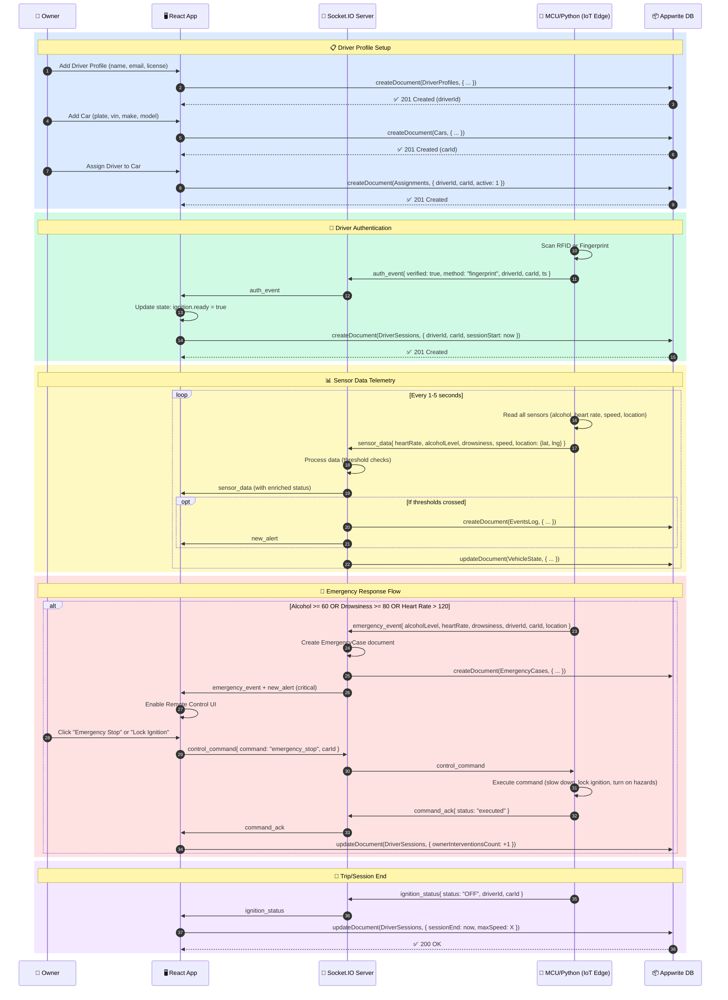
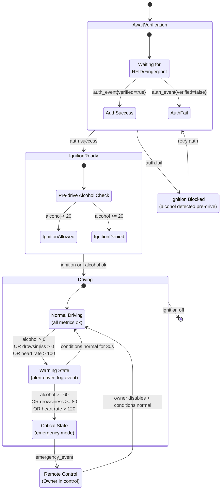

# SafePilot – IoT Alcohol & Drowsiness Safety System

SafePilot is an IoT-enabled safety platform that authenticates drivers (RFID/Fingerprint), screens for alcohol and drowsiness, and empowers car owners/admins with real-time controls, telemetry, and alerting. It integrates edge Python for drowsiness detection with a modern React web app and Appwrite for secure data storage.

## Features

- **Driver Authentication** via RFID or Fingerprint. Ignition is allowed only after successful verification.
- **Alcohol Screening** before and during drive. Critical detection enables owner remote control and raises emergency alerts.
- **Drowsiness Detection (Python)** with camera pipeline; raises warnings/critical alerts.
- **Real-time Telemetry** (heart rate, speed, proximity, location) over WebSockets.
- **Owner Portal** to manage cars, drivers, and assignments; view records/history.
- **Admin Utilities** for users and project management.
- **Emergency Flow** bundles alcohol + heartbeat + driver + car + location to the owner.

## Architecture

### System Architecture Diagram

```mermaid
graph TD
    %% Define styles
    classDef hardware fill:#f97316,stroke:#ea580c,color:#fff,stroke-width:2px,rx:5,ry:5;
    classDef edge fill:#8b5cf6,stroke:#7c3aed,color:#fff,stroke-width:2px,rx:5,ry:5;
    classDef backend fill:#06b6d4,stroke:#0891b2,color:#fff,stroke-width:2px,rx:5,ry:5;
    classDef frontend fill:#10b981,stroke:#059669,color:#fff,stroke-width:2px,rx:5,ry:5;
    classDef db fill:#f59e0b,stroke:#d97706,color:#fff,stroke-width:2px,rx:5,ry:5;
    classDef subgraphStyle fill:#f8fafc,stroke:#cbd5e1,stroke-width:1px,rx:8,ry:8;

    %% Hardware Layer
    subgraph IoT_Edge [🚗 IoT Edge Layer (Vehicle)]
        style IoT_Edge fill:#fff7ed,stroke:#fed7aa
        RFID_Fingerprint[RFID/Fingerprint<br/>Sensor]:::hardware
        Alcohol[Alcohol Sensor<br/>MQ-3/MQ-135]:::hardware
        HeartRate[Heart Rate<br/>MAX30102]:::hardware
        Proximity[Proximity<br/>HC-SR04]:::hardware
        GPS[GPS<br/>NEO-6M]:::hardware
        Camera[Camera<br/>Module]:::hardware
        MCU[ESP32 / RPi<br/>Controller]:::hardware
        Actuators[Actuators<br/>(Ignition/Brakes/Hazards)]:::hardware
    end

    %% Edge Software
    subgraph Edge_Software [🐍 Edge Software (Python)]
        style Edge_Software fill:#faf5ff,stroke:#e9d5ff
        Drowsiness[Drowsiness Detection<br/>(OpenCV + MediaPipe)]:::edge
        DataPreprocessing[Data Preprocessing<br/>& Filtering]:::edge
    end

    %% Backend Layer
    subgraph Backend [☁️ Backend Layer]
        style Backend fill:#ecfeff,stroke:#a5f3fc
        SocketIO[Socket.IO Server<br/>(Real-time Events)]:::backend
        MQTT[MQTT Broker<br/>(HiveMQ Cloud)]:::backend
        DecisionEngine[Decision Engine<br/>(Threshold Logic)]:::backend
        EventLogger[Event Logger<br/>(Appwrite Sync)]:::backend
    end

    %% Frontend Layer
    subgraph Frontend [🌐 Web Application]
        style Frontend fill:#ecfdf5,stroke:#a7f3d0
        React[React + Vite]:::frontend
        Dashboard[Dashboard<br/>(Telemetry/Alerts)]:::frontend
        Controls[Remote Controls<br/>(Owner Portal)]:::frontend
        OwnerPortal[Owner Portal<br/>(Cars/Drivers/Records)]:::frontend
        Admin[Admin Utilities]:::frontend
    end

    %% Database Layer
    subgraph Database [🔒 Appwrite Cloud]
        style Database fill:#fefce8,stroke:#fde047
        Auth[Authentication &<br/>Authorization]:::db
        DB_Collections[(Collections:<br/>Alerts/Sensors/Cars/etc.)]:::db
        Storage[(File Storage<br/>(Camera Footage))]:::db
    end

    %% Connections
    RFID_Fingerprint -->|Auth Data| MCU
    Alcohol -->|Alcohol Level| MCU
    HeartRate -->|BPM| MCU
    Proximity -->|Distance| MCU
    GPS -->|Lat/Lng| MCU
    Camera -->|Video Stream| Drowsiness
    Drowsiness -->|Drowsiness Score| DataPreprocessing
    DataPreprocessing -->|Filtered Data| MCU
    MCU <-->|MQTT Messages| MQTT
    MQTT <-->|WebSocket Events| SocketIO
    SocketIO -->|Process Events| DecisionEngine
    DecisionEngine -->|Log Events| EventLogger
    EventLogger -->|Persist Data| DB_Collections
    SocketIO <-->|Real-time Updates| React
    React <-->|CRUD Operations| DB_Collections
    React <-->|Login/Session| Auth
    React --> Dashboard
    React --> Controls
    React --> OwnerPortal
    React --> Admin
    Controls -->|Control Signals| SocketIO
    SocketIO -->|Commands| MQTT
    MQTT -->|Actuate| MCU
    MCU -->|Control| Actuators
```

### Component Diagram

```mermaid
graph TB
    %% Styles
    classDef webapp fill:#10b981,stroke:#059669,color:#fff,stroke-width:2px,rx:5,ry:5;
    classDef backend fill:#06b6d4,stroke:#0891b2,color:#fff,stroke-width:2px,rx:5,ry:5;
    classDef iot fill:#f97316,stroke:#ea580c,color:#fff,stroke-width:2px,rx:5,ry:5;
    classDef db fill:#f59e0b,stroke:#d97706,color:#fff,stroke-width:2px,rx:5,ry:5;
    classDef subgraphStyle fill:#f8fafc,stroke:#cbd5e1,stroke-width:1px,rx:8,ry:8;

    %% Web App Components
    subgraph WebApp [🌐 Web Application Components]
        style WebApp fill:#ecfdf5,stroke:#a7f3d0
        ReactApp[React App<br/>(Main Entry)]:::webapp
        WebSocketCtx[WebSocketContext.jsx<br/>(Real-time State)]:::webapp
        AuthCtx[AuthContext.jsx<br/>(User Session)]:::webapp
        DataService[dataService.js<br/>(Appwrite API)]:::webapp
        
        subgraph Pages [Pages & Components]
            style Pages fill:#f0fdf4,stroke:#86efac
            DashboardComp[Dashboard.jsx<br/>(Telemetry/Alerts)]:::webapp
            OwnerGarage[OwnerGarage.jsx<br/>(Cars Management)]:::webapp
            OwnerDrivers[OwnerDrivers.jsx<br/>(Drivers Management)]:::webapp
            RemoteControls[RemoteControl.jsx<br/>(Vehicle Control)]:::webapp
            Alerts[Alerts.jsx<br/>(Alert History)]:::webapp
            Records[Records.jsx<br/>(Trip Records)]:::webapp
        end
    end

    %% Backend Components
    subgraph Backend [☁️ Backend Services]
        style Backend fill:#ecfeff,stroke:#a5f3fc
        AppwriteCloud[Appwrite Cloud<br/>(BaaS Platform)]:::db
        SocketIOServer[Socket.IO Server<br/>(server.js)]:::backend
        subgraph SocketIO_Features [Socket.IO Features]
            style SocketIO_Features fill:#cffafe,stroke:#67e8f9
            RealTimeEvents[Real-time Events]:::backend
            ControlCommands[Control Commands]:::backend
            SessionManagement[Session Management]:::backend
        end
    end

    %% IoT Edge Components
    subgraph IoT_Edge [🚗 IoT Edge Layer]
        style IoT_Edge fill:#fff7ed,stroke:#fed7aa
        ESP32[ESP32 / RPi<br/>Microcontroller]:::iot
        subgraph Sensors [Sensor Suite]
            style Sensors fill:#ffedd5,stroke:#fdba74
            RFID[RFID Reader]:::iot
            Fingerprint[Fingerprint Scanner]:::iot
            AlcoholSensor[Alcohol Sensor]:::iot
            HeartRateSensor[Heart Rate Sensor]:::iot
            Ultrasonic[Ultrasonic Proximity]:::iot
            GPS_Module[GPS Module]:::iot
        end
        PythonDrowsiness[Python Drowsiness<br/>Detection Engine]:::iot
        CameraMod[Camera Module]:::iot
        ActuatorMod[Actuators]:::iot
    end

    %% Connections
    ReactApp -->|Provides| WebSocketCtx
    ReactApp -->|Provides| AuthCtx
    ReactApp -->|Uses| DataService
    ReactApp -->|Renders| Pages
    DataService -->|API Calls| AppwriteCloud
    WebSocketCtx <-->|WebSocket| SocketIOServer
    SocketIOServer -->|Implements| SocketIO_Features
    SocketIOServer <-->|MQTT| ESP32
    ESP32 -->|Reads| Sensors
    CameraMod -->|Frames| PythonDrowsiness
    PythonDrowsiness -->|Drowsiness Data| ESP32
    ESP32 -->|Controls| ActuatorMod
```

### Sequence Diagram



### State Machine Diagram



### Tech Stack

#### Hardware (Suggested)
- RFID reader (e.g., RC522) or Fingerprint sensor (e.g., R307)
- Alcohol sensor (MQ-3 / MQ-135)
- Heart-rate sensor (MAX30102)
- Ultrasonic proximity (HC-SR04)
- GPS (NEO‑6M), Motor controller/actuators
- Microcontroller: ESP32 or Raspberry Pi (depending on IO needs)

#### Edge Software (Python)
- Python 3.10+
- OpenCV, MediaPipe or dlib (for eye-aspect ratio or blink detection)
- asyncio + socket client (websocket or Socket.IO Python client)
- Requests/HTTP client (fallback)

#### Web Application
- React + Vite + React Router
- Socket.IO client
- Tailwind-style utility classes
- Appwrite Web SDK

#### BaaS / Database
- Appwrite Cloud (Auth, DB, Documents)

## Data Model (Appwrite Collections)

The system manages these data collections:

- `Alerts`: level, title, description, ts
- `Sensors`: heartRate, drowsiness, alcoholLevel, proximity, speed, location_lat/lng, ts
- `Locations`: lat, lng, ts
- `Contacts`
- `Users (App data)` (optional)
- `Cars`: ownerId, alias, plateNumber, vin, make, model, year (int), color
- `DriverProfiles`: ownerId, name, email, phone, licenseNo, notes, violations, lastMedicalCheck
- `Assignments`: ownerId, carId, driverProfileId, active (int 0/1), ts, endedAt
- `DriverRecords`: driverProfileId, type, level, title, description, ts
- `VehicleState`: carId, driverId, speed, alcoholStatus, drowsinessLevel, heartRate, location_lat/lng, controlMode, lastUpdated
- `EventsLog`: eventType, severity, carId, driverId, snap_speed, snap_alcoholLevel, snap_heartRate, snap_location_lat, snap_location_lng, timestamp
- `DriverSessions`: driverId, carId, sessionStart, sessionEnd, maxSpeed, drowsinessWarningsCount, alcoholIncidentsCount, ownerInterventionsCount
- `EmergencyCases`: caseType, carId, driverId, resolved, ownerActionTaken, createdAt, resolvedAt

Permissions are configured for authenticated users with appropriate read/write access.

## Core Flows

1. **Verification → Ignition**: Edge verifies driver (RFID/Fingerprint). Web shows `auth_event` and sets ignition ready.
2. **Pre-drive Alcohol Check**: If alcohol detected, ignition is blocked and alert is sent.
3. **During Trip**: If alcohol suddenly spikes, emergency event is raised, remote control enables, and the car slows down (IoT side).
4. **Owner Controls**: Remote control panel is enabled only on critical events; actions are emitted over WebSockets.

## Drowsiness Detection (Python) – Overview

- Captures camera frames and computes eye-aspect ratio using MediaPipe Face Mesh
- Maintains scoring algorithms with time-window analysis
- Emits `warning` or `critical` alerts when thresholds are crossed
- Sends events and metrics to the web server via WebSocket/HTTP protocols

## Key System Components

- `WebSocketContext` – Real-time events and state management (ignition, remote-control, auth, emergency)
- `DataService` – Appwrite document operations (Cars, Drivers, Assignments, Records, Alerts)
- `Owner Management` – Vehicle and driver administration interface
- `Control Systems` – Remote control UI and emergency response
- `Mock Server` – Development and testing environment
- `Database Setup` – Collection creation with attributes, indexes, and permissions

## Project Aim

SafePilot addresses critical road safety challenges by creating an integrated IoT ecosystem that prevents impaired and drowsy driving through multi-layered verification and real-time monitoring. The system empowers vehicle owners with remote oversight capabilities while maintaining driver privacy and providing immediate emergency response protocols.


