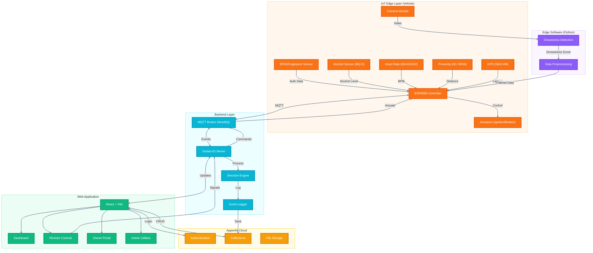
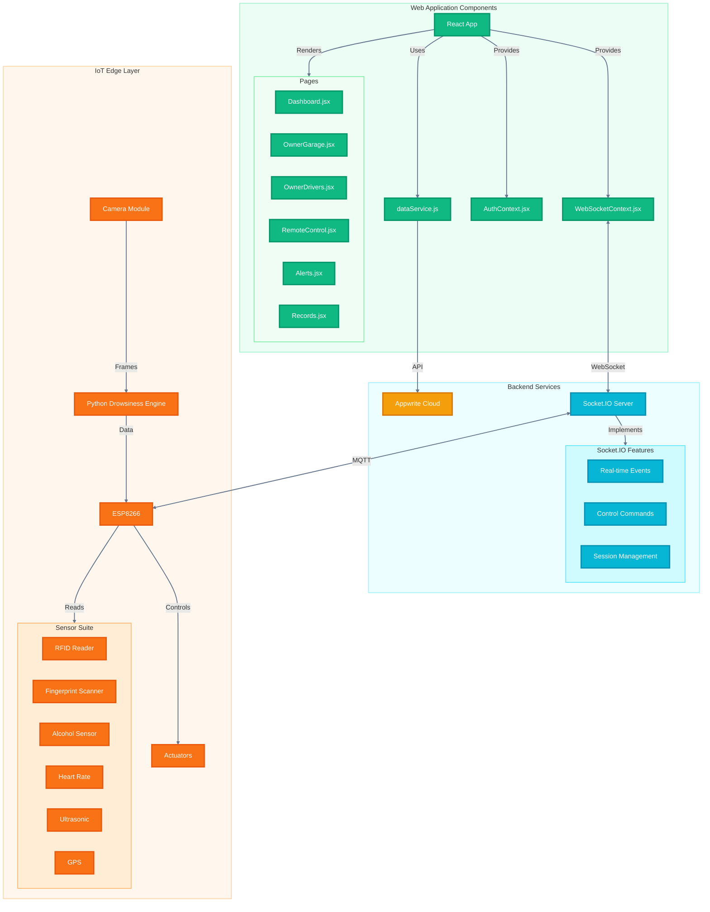
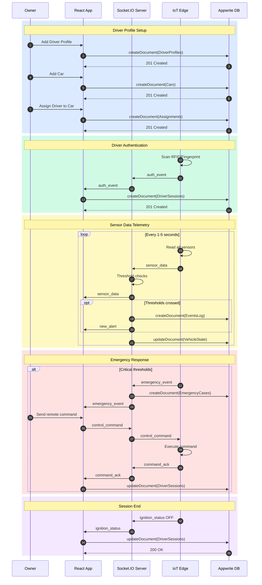
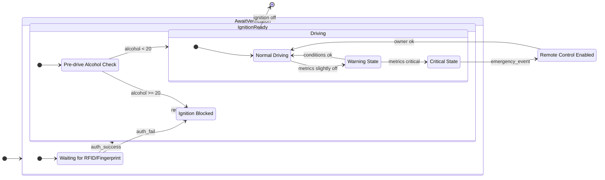

# SafePilot – IoT Alcohol & Drowsiness Safety System

SafePilot is an IoT-enabled safety platform that authenticates drivers (RFID/Fingerprint), screens for alcohol and drowsiness, and empowers car owners/admins with real-time controls, telemetry, and alerting. It integrates edge Python for drowsiness detection with a modern React web app and Appwrite for secure data storage.

## Features

- **Driver Authentication** via RFID or Fingerprint. Ignition is allowed only after successful verification.
- **Alcohol Screening** before and during drive. Critical detection enables owner remote control and raises emergency alerts.
- **Drowsiness Detection (Python)** with camera pipeline; raises warnings/critical alerts.
- **Real-time Telemetry** (heart rate, speed, proximity, location) over WebSockets.
- **Owner Portal** to manage cars, drivers, and assignments; view records/history.
- **Admin Utilities** for users and project management.
- **Emergency Flow** bundles alcohol + heartbeat + driver + car + location to the owner.

## Architecture

### System Architecture Diagram

### Component Diagram

### Sequence Diagram

### State Machine Diagram

### Tech Stack

#### Hardware (Suggested)
- RFID reader (e.g., RC522) or Fingerprint sensor (e.g., R307)
- Alcohol sensor (MQ-3 / MQ-135)
- Heart-rate sensor (MAX30102)
- Ultrasonic proximity (HC-SR04)
- GPS (NEO‑6M), Motor controller/actuators
- Microcontroller: ESP32 or Raspberry Pi (depending on IO needs)

#### Edge Software (Python)
- Python 3.10+
- OpenCV, MediaPipe or dlib (for eye-aspect ratio or blink detection)
- asyncio + socket client (websocket or Socket.IO Python client)
- Requests/HTTP client (fallback)

#### Web Application
- React + Vite + React Router
- Socket.IO client
- Tailwind-style utility classes
- Appwrite Web SDK

#### BaaS / Database
- Appwrite Cloud (Auth, DB, Documents)

## Data Model (Appwrite Collections)

The system manages these data collections:

- `Alerts`: level, title, description, ts
- `Sensors`: heartRate, drowsiness, alcoholLevel, proximity, speed, location_lat/lng, ts
- `Locations`: lat, lng, ts
- `Contacts`
- `Users (App data)` (optional)
- `Cars`: ownerId, alias, plateNumber, vin, make, model, year (int), color
- `DriverProfiles`: ownerId, name, email, phone, licenseNo, notes, violations, lastMedicalCheck
- `Assignments`: ownerId, carId, driverProfileId, active (int 0/1), ts, endedAt
- `DriverRecords`: driverProfileId, type, level, title, description, ts
- `VehicleState`: carId, driverId, speed, alcoholStatus, drowsinessLevel, heartRate, location_lat/lng, controlMode, lastUpdated
- `EventsLog`: eventType, severity, carId, driverId, snap_speed, snap_alcoholLevel, snap_heartRate, snap_location_lat, snap_location_lng, timestamp
- `DriverSessions`: driverId, carId, sessionStart, sessionEnd, maxSpeed, drowsinessWarningsCount, alcoholIncidentsCount, ownerInterventionsCount
- `EmergencyCases`: caseType, carId, driverId, resolved, ownerActionTaken, createdAt, resolvedAt

Permissions are configured for authenticated users with appropriate read/write access.

## Core Flows

1. **Verification → Ignition**: Edge verifies driver (RFID/Fingerprint). Web shows `auth_event` and sets ignition ready.
2. **Pre-drive Alcohol Check**: If alcohol detected, ignition is blocked and alert is sent.
3. **During Trip**: If alcohol suddenly spikes, emergency event is raised, remote control enables, and the car slows down (IoT side).
4. **Owner Controls**: Remote control panel is enabled only on critical events; actions are emitted over WebSockets.

## Drowsiness Detection (Python) – Overview

- Captures camera frames and computes eye-aspect ratio using MediaPipe Face Mesh
- Maintains scoring algorithms with time-window analysis
- Emits `warning` or `critical` alerts when thresholds are crossed
- Sends events and metrics to the web server via WebSocket/HTTP protocols

## Key System Components

- `WebSocketContext` – Real-time events and state management (ignition, remote-control, auth, emergency)
- `DataService` – Appwrite document operations (Cars, Drivers, Assignments, Records, Alerts)
- `Owner Management` – Vehicle and driver administration interface
- `Control Systems` – Remote control UI and emergency response
- `Database Setup` – Collection creation with attributes, indexes, and permissions

## Project Aim

SafePilot addresses critical road safety challenges by creating an integrated IoT ecosystem that prevents impaired and drowsy driving through multi-layered verification and real-time monitoring. The system empowers vehicle owners with remote oversight capabilities while maintaining driver privacy and providing immediate emergency response protocols.

